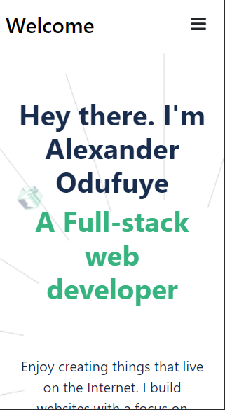

# MyPortfolio
# This is MyPortfolio Project

   This is a mobile-first portfolio project built using Semantic HTML, CSS and JavaScript. It includes the navigation bar, the headline, a list of past projects(which includes skills, languages and frameworks used), the about section and a contact form.
   Also add github Pages to make my Portfolio online available.

  

  
  
  ## Built With

- Html,CSS, Javascript
- Git, Github
- Visual Studio Code

## Live Demo

[Live Demo Link]()

## Getting Started

**This is an example of how you may create your mobile and desktop responsive porfolio**

## Prerequisites

### Local Usage
- Create repository
- Clone it local device using git
- Add files , commit and push them to github
- Run linters 
- Deploy to resolve errors

### Tools needed to run project locally
- Git
- Visual Studio Code

## 👤 Author

- GitHub: [@githubhandle](https://github.com/alexander16108)
- Twitter: [@twitterhandle](https://twitter.com/alexander-mayowa)
- LinkedIn: [LinkedIn](https://www.linkedin.com/in/codingrex/)

## Acknowledgments

- Figma : [Figma Template](https://www.figma.com/file/l7SqJ3ZfkAKih9sFxvWSR4/Microverse-Student-Project-1?node-id=1%3A468)

## 🤝 Contributing

Contributions, issues, and feature requests are welcome!

Feel free to check the [issues page](https://github.com/alexander16108/Portfolio/issues).

## Show your support

Give a ⭐️ if you like this project!